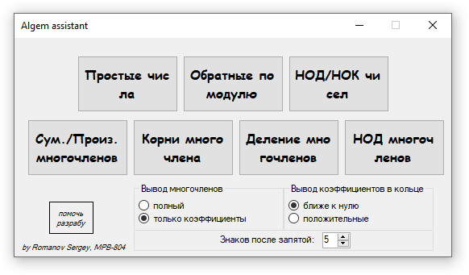
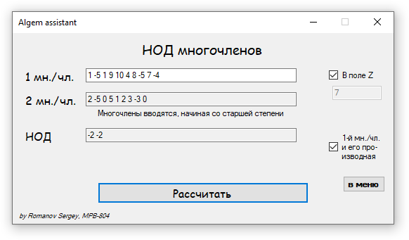
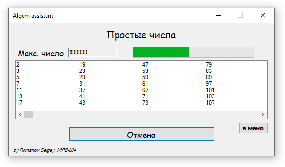
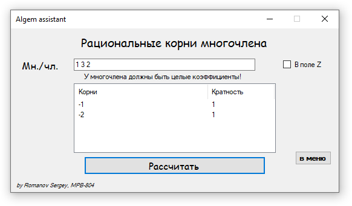
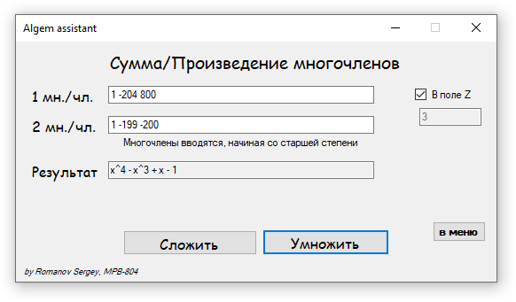

# Algem-Assistant

Лёгкое приложение, решающее большинство задач линейной алгебры из раздела "Алгебраические операции над многочленами"

Поддерживает такие функции как:
- Нахождение наибольшего общего делителя для чисел и многочленов
- Нахождение наименьшего общего кратного для чисел
- Поиск простых чисел меньше заданного
- Определение обратных по модулю чисел
- Сумма, произведение и деление многочленов
- Нахождение корней многочлена с учётом их кратности
- Определение производной многочлена

Все операции можно выполнить в произвольном после целых чисел. Так же можно задать краткий или полный вывод многочленов, правило вывода коэфициентов в кольце, а так же округление до заданного количества знаков после запятой.

При поиске простых чисел задействуется многопоточность, что позволяет использовать приложение во время их вычислений.

## Скриншоты интерфейса

